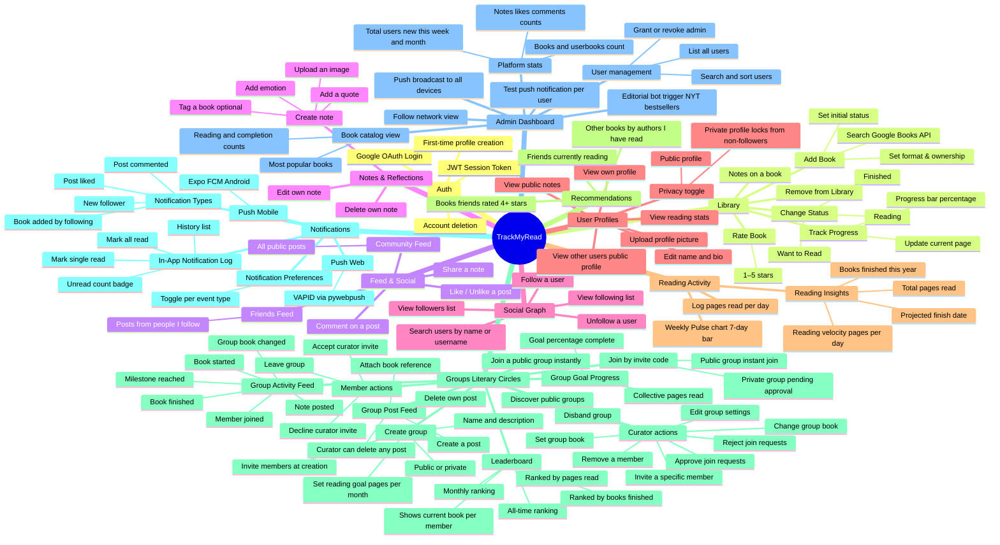
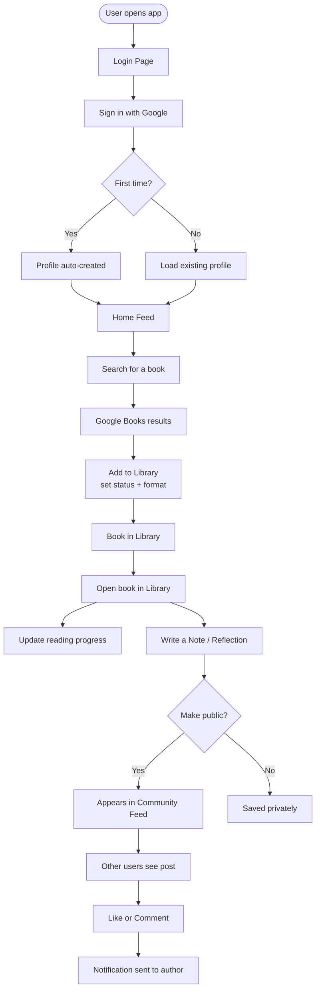
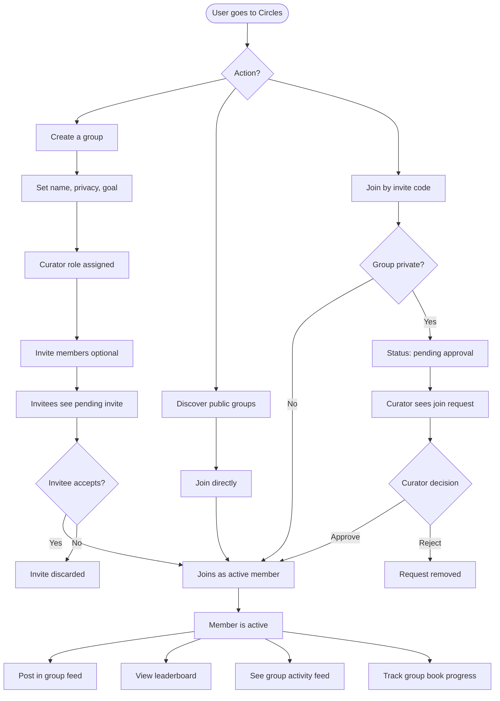
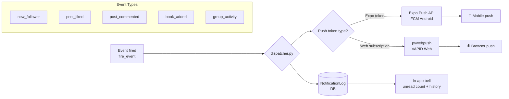
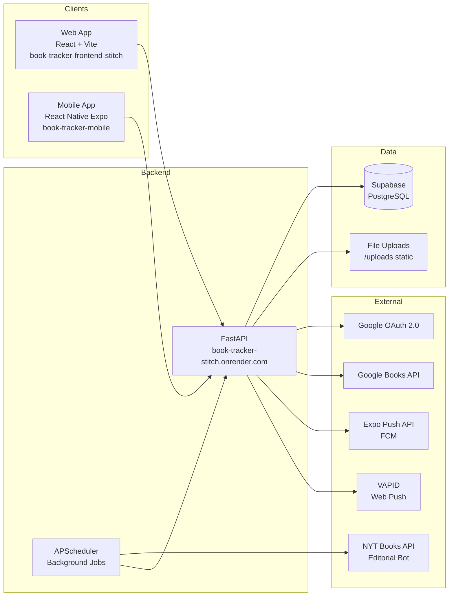

# TrackMyRead — Platform Feature Map

> Last updated: April 19, 2026  
> Use this as the single source of truth for what the platform does.  
> Mermaid diagrams render in GitHub, Notion, and most markdown viewers.

---

## 1. Full Feature Map

---

## 2. User Journey — Onboarding to First Post

---

## 3. User Journey — Groups Flow

---

## 4. Notification Routing

---

## 5. Architecture Overview

